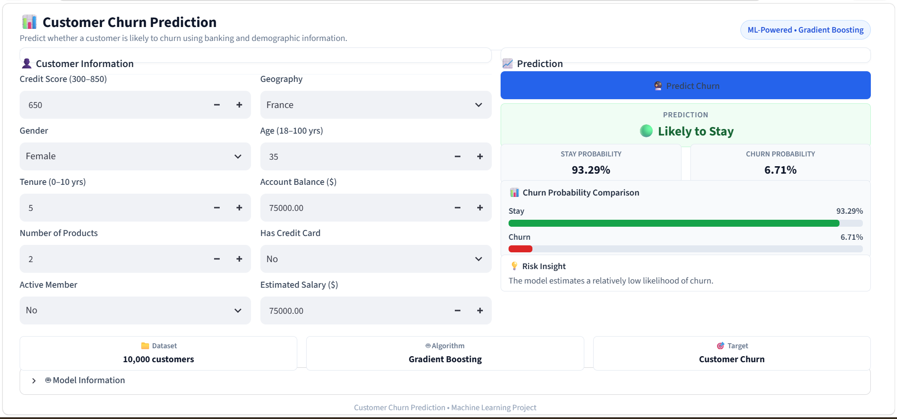

# 📊 Customer Churn Prediction


Customer Churn Prediction is an end-to-end machine learning project designed to identify bank customers at risk of leaving the institution. By analyzing demographic, financial, and behavioral patterns, the system computes probabilistic churn metrics and serves real-time predictions via an interactive Streamlit dashboard.

---

## 🎓 CodSoft Internship — Task 3

This project was developed as part of the **CodSoft Machine Learning Internship, Task 3: Customer Churn Prediction**.

---

## 🚀 Project Overview

Customer churn poses a critical financial challenge for retail banks. Retaining existing customers is significantly more cost-effective than acquiring new ones. This project addresses the business problem by building an end-to-end predictive workflow: from exploratory data analysis and feature engineering to model comparison and web-based dashboard deployment.

---

## ✨ Key Features

- **Exploratory Data Analysis**: Data exploration identifying key behavioral and demographic churn drivers.
- **Data Preprocessing**: Pipeline transformation using `StandardScaler` for continuous numerical features and `OneHotEncoder` for categorical features.
- **Multiple ML Model Comparison**: Performance benchmarking across Logistic Regression, Random Forest, and Gradient Boosting.
- **Gradient Boosting Model**: Selected model architecture optimized for classification accuracy and ROC-AUC performance.
- **Probability-Based Churn Prediction**: Generates calibrated percentage metrics for churn risk assessment.
- **Interactive Streamlit Dashboard**: User-friendly single-page application for dynamic customer risk evaluation.
- **Model Persistence with Joblib**: Pipeline serialization preserving preprocessing states and feature alignment.
- **Real-Time Prediction Interface**: Direct user inputs producing instant risk classification outputs.

---

## 📊 Dataset

The model is trained on historical customer records from `Churn_Modelling.csv`:

- **Total Records**: 10,000 customer entries
- **Original Attributes**: 14 columns
- **Final Predictive Features**: 10 attributes
- **Target Variable**: `Exited`
  - `0` = Stayed (Retained)
  - `1` = Churned (Exited)

---

## 🔍 Exploratory Data Analysis

Key verified statistical findings from the dataset analysis:

- **Overall Churn Rate**: 79.63% (7,963) of customers stayed, while 20.37% (2,037) churned.
- **Geographic Differences**: Customers in **Germany** exhibited a higher observed churn rate compared to those in France and Spain.
- **Gender Insights**: Female customers showed a higher observed churn rate than male customers in this dataset.
- **Member Activity**: Inactive members (`IsActiveMember = 0`) had a higher observed churn rate than active members.
- **Account Balance**: Churned customers had a higher average account balance compared to retained customers.
- **Product Volume**: Customers holding 3 or 4 products showed very high observed churn rates. *(Note: These product tiers contain relatively few customer records and should be interpreted cautiously).*

---

## ⚙️ Data Preprocessing

The dataset underwent structured transformation before model training:

- **Dropped Non-Predictive Columns**: Removed `RowNumber`, `CustomerId`, and `Surname`.
- **Removed Temporary Variables**: Dropped temporary EDA column `AgeGroup`.
- **Numerical Feature Scaling**: Applied `StandardScaler` to continuous variables (`CreditScore`, `Age`, `Tenure`, `Balance`, `NumOfProducts`, `EstimatedSalary`).
- **Categorical Feature Encoding**: Applied `OneHotEncoder(handle_unknown="ignore")` to nominal features (`Geography`, `Gender`).
- **Data Splitting**: Executed an 80/20 stratified train-test split (`test_size=0.20`, `stratify=y`, `random_state=42`) to preserve target distribution.

---

## 🤖 Machine Learning Models

Three supervised machine learning algorithms were trained and evaluated:

1. **Logistic Regression**: Baseline linear classification model.
2. **Random Forest**: Ensemble model using randomized decision trees.
3. **Gradient Boosting**: Sequential ensemble boosting algorithm building weak learners to optimize pseudo-residuals.

---

## 📈 Model Performance

All models were evaluated on the held-out test split of 2,000 records:

| Model | Accuracy | Precision | Recall | F1-Score | ROC-AUC |
|---|---:|---:|---:|---:|---:|
| Logistic Regression | 80.80% | 58.91% | 18.67% | 28.36% | 77.48% |
| Random Forest | 85.90% | 76.60% | 44.23% | 56.07% | 85.32% |
| Gradient Boosting | 87.05% | 79.37% | 49.14% | 60.70% | 86.97% |

*Note: Gradient Boosting was selected based on performance on the held-out test split for this specific dataset.*

---

## 🖥️ Streamlit Application

The Streamlit dashboard (`app.py`) provides an intuitive web-based decision tool:

- **Customer Input Form**: Interactive inputs for demographic, financial, and product parameters.
- **Prediction Button**: Triggers inference using the pre-loaded machine learning pipeline.
- **Stay Probability**: Visual metric displaying retention likelihood percentage.
- **Churn Probability**: Visual metric displaying risk likelihood percentage.
- **Risk Level**: Automated risk categorization (Low, Medium, High).
- **Probability Comparison**: Visual progress bar contrasting Stay vs. Churn probabilities.
- **Model Information**: Collapsible metadata viewer detailing test metrics and feature parameters.

---

## 📸 Application Preview



---

## 🏗️ Project Structure

```text
Customer Churn Prediction/
├── dataset/
│   └── Churn_Modelling.csv
├── models/
│   └── customer_churn_model.pkl
├── notebooks/
│   └── Customer_Churn_Prediction.ipynb
├── screenshots/
│   └── dashboard.png
├── app.py
├── requirements.txt
├── README.md
└── .gitignore
```

---

## 🛠️ Technologies Used

- Python 3.11+
- Pandas
- NumPy
- Scikit-learn
- Joblib
- Streamlit
- Jupyter Notebook
- Git
- GitHub

---

## 🚀 Installation & Execution

### Prerequisites

- Python 3.11 or higher installed on your system.

### 1. Clone the Repository

```bash
git clone https://github.com/mrsanjith95/customer-churn-prediction.git
cd "Customer Churn Prediction"
```

### 2. Set Up Virtual Environment

```bash
# Create virtual environment
python -m venv .venv

# Activate on Windows (PowerShell / Command Prompt)
.\.venv\Scripts\activate

# Activate on macOS / Linux
source .venv/bin/activate
```

### 3. Install Dependencies

```bash
pip install -r requirements.txt
```

### 4. Launch Application

```bash
streamlit run app.py
```

---

## 🔧 Model & Dependency Compatibility

The serialized model (`models/customer_churn_model.pkl`) was saved with specific dependency versions:

- `scikit-learn==1.6.1`
- `joblib==1.6.0`
- `pandas==3.0.6`
- `numpy==2.4.6`
- `streamlit==1.64.0`

The serialized model should be loaded using compatible dependency versions to prevent deserialization errors or pipeline mismatches.

---

## ⚠️ Limitations

- **Dataset Scope**: Model parameters reflect patterns present in `Churn_Modelling.csv` and may not generalize directly to different banking domains.
- **Probabilistic Estimates**: Output values represent statistical likelihoods based on historical data rather than guaranteed outcomes.
- **Test Set Specificity**: Reported evaluation metrics are derived from the single held-out test split.
- **Static Dynamics**: External macro-economic shifts and policy changes are not dynamically captured by the trained model.

---

## 🔮 Future Improvements

- **Hyperparameter Tuning**: Optimize model hyperparameters using Grid Search or Bayesian Optimization.
- **Cross-Validation**: Incorporate k-fold cross-validation for more robust performance estimates.
- **Threshold Optimization**: Adjust decision probability thresholds to prioritize recall according to customer retention economics.
- **Feature Engineering**: Incorporate additional behavioral attributes such as transaction frequency and interaction history.
- **Explainability**: Integrate SHAP or LIME for individual feature attribution explanations.
- **Cloud Deployment**: Host the application on Streamlit Community Cloud or cloud container platforms.

---

## 🔗 Project Links

- **GitHub Repository**: [https://github.com/mrsanjith95/customer-churn-prediction](https://github.com/mrsanjith95/customer-churn-prediction)
